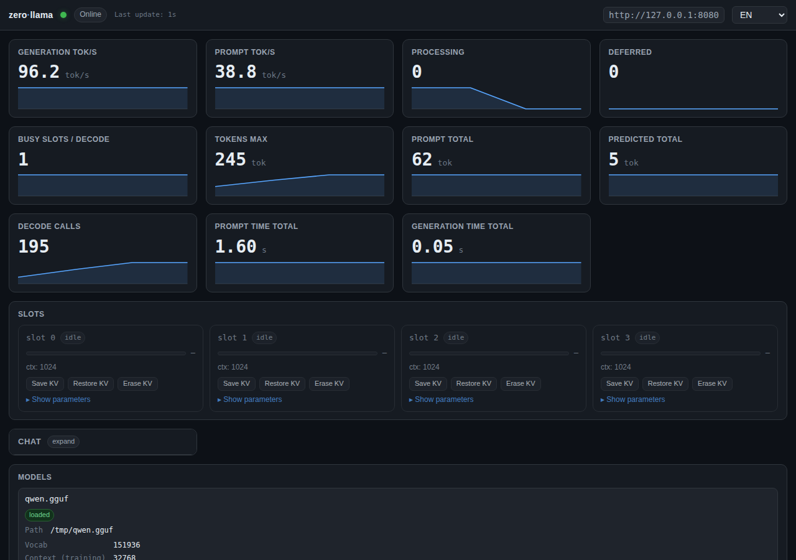
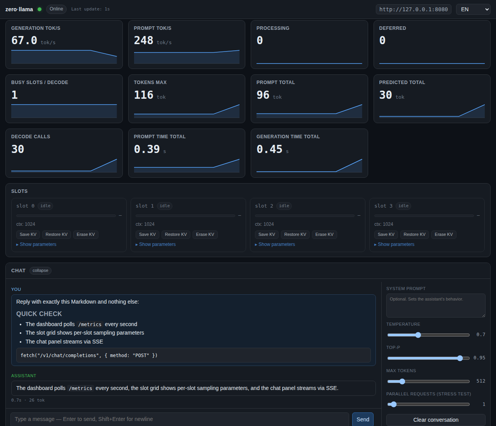
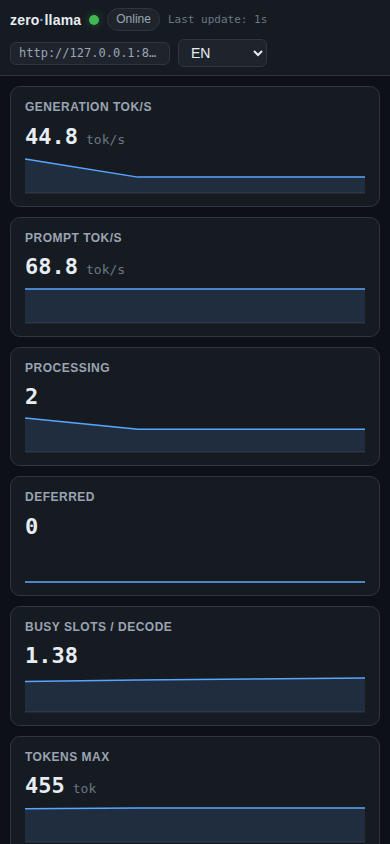

# zerollama-dashboard

[llama.cpp](https://github.com/ggml-org/llama.cpp) サーバの状態を一画面で
見せるライブダッシュボード。ブラウザで開けばモデルの様子が分かり、
同じ画面でモデルとチャットもできます。

[**▶ ライブデモを見る**](https://jungrok5.github.io/zerollama-dashboard/?demo=1) — 本物のサーバなしで雰囲気を試せます。

> Languages: [English](README.md) · [한국어](README.ko.md) · **日本語** · [简体中文](README.zh-CN.md) · [Español](README.es.md)





## できること

- **リアルタイム表示** — 生成速度、リクエストキュー、スロットの動きが
  そのまま見える
- **モデルとチャット**をダッシュボードの中で直接。ストリーミング応答、
  Markdown レンダリング、停止ボタン、temperature / top_p / max_tokens
  スライダー
- **平易な助言** — サーバが圧迫されたら教えてくれます
  (例: 「キューが伸びています、`--parallel` を +1 してみては?」)
- **スロットごとの詳細** — サンプリング設定すべて (temperature, top_k,
  top_p, repeat_penalty, mirostat …)
- **5 か国語 UI** — 英語 / 한국어 / 日本語 / 简体中文 / Español。
  ブラウザ言語で自動起動し、ヘッダからいつでも切替可能
- **シングルモデルとルーターサーバ**の両方を自動検出

## セットアップ

比較的新しい llama-server に `--metrics` を付けるだけ。一番楽なのは
llama-server に `monitor.html` も配信させる方法:

```bash
mkdir -p public
cp monitor.html public/
llama-server -m model.gguf --metrics --port 8080 --path ./public
```

`http://localhost:8080/monitor.html` にアクセスして完了。

別マシンのサーバを見るときは `monitor.html` を任意の静的ホストに置いて
`?server=` を渡します:

```
http://localhost:8000/monitor.html?server=http://10.0.0.5:8080
```

## URL オプション

| パラメータ | 役割 |
|---|---|
| `server` | llama-server URL (既定: 同一 origin) |
| `model` | ルーターモード: 既定で選ぶモデル |
| `lang` | UI 言語 (`en` / `ko` / `ja` / `zh-CN` / `es`) |
| `prompt` | チャット入力欄を初期化 |
| `demo` | `1` か `router` — 内蔵モックサーバ |
| `poll` | ポーリング間隔 (ms、既定 `1000`) |
| `log` | ログファイルパス (省略時は自動検出) |

設定は URL の中にしかないので、リンクを共有すれば同じ画面が再現されます。

## 自分でデモを公開する

誰でもアクセスできる URL が欲しい場合、GitHub Pages が無料で
idle sleep もありません:

1. リポジトリ **Settings → Pages → Source = "GitHub Actions"**
2. `main` に push

同梱の `.github/workflows/pages.yml` が自動でビルド・デプロイ。
訪問者は `https://<ユーザ>.github.io/<repo>/?demo=1` でアクセスできます。
すべて静的なので維持するバックエンドはありません。

## プライバシーと安全性

- ダッシュボードは指定された llama-server の URL (と、同一 origin の
  ログファイルパス) 以外にはデータを送りません。
- Cookie・localStorage・トラッキングは一切使いません。
- サーバの状態を変える操作 — モデルの load/unload、スロット KV の
  save/restore/erase — は必ず確認ダイアログを挟みます。
- チャットの Markdown レンダリングは安全。モデルが何を出力しても
  HTML やスクリプトとして抜け出せません。

## ライセンス

[MIT](LICENSE). [abhiFSD/llama.cpp-Monitor-Dashboard](https://github.com/abhiFSD/llama.cpp-Monitor-Dashboard) にインスパイアされています。
コントリビュートする場合は [CLAUDE.md](CLAUDE.md) を参照。
