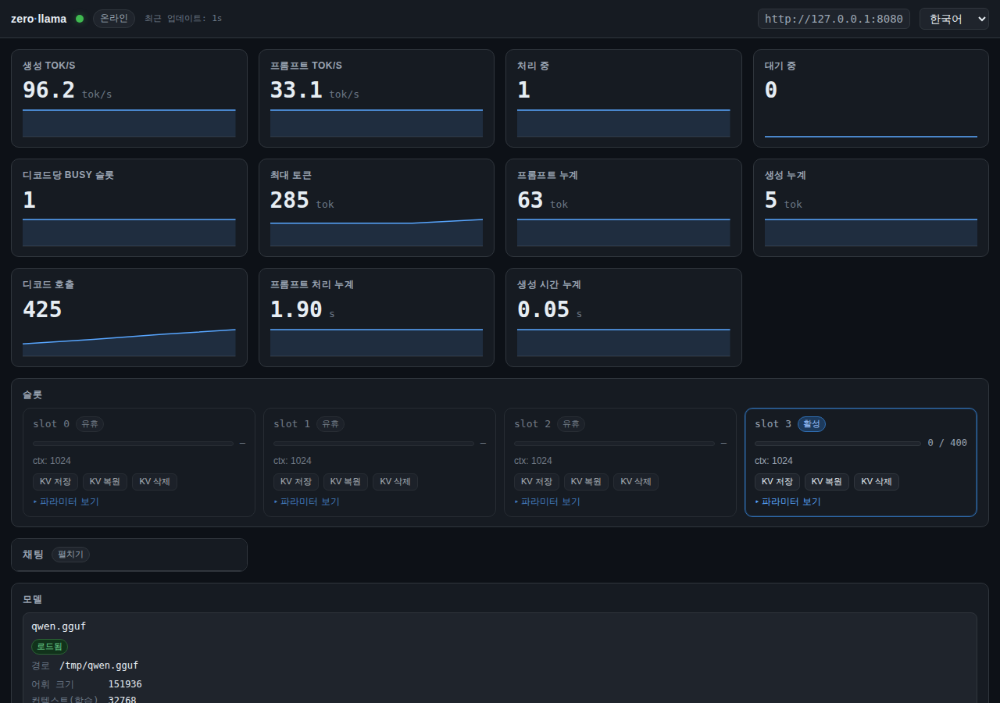
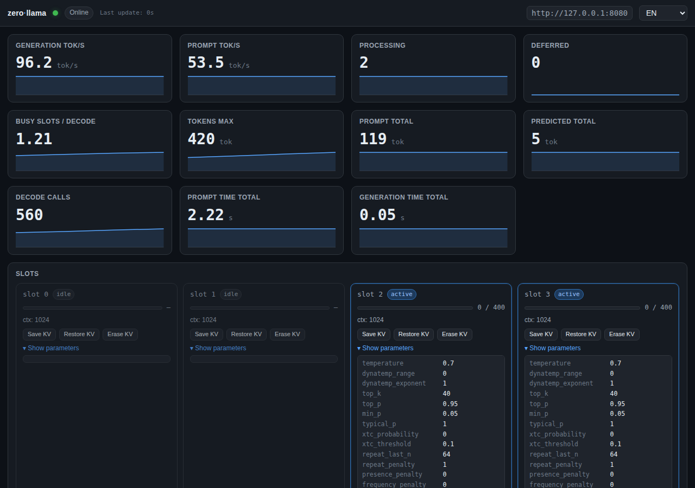

# zerollama-dashboard

[llama.cpp](https://github.com/ggml-org/llama.cpp) 서버를 위한
의존성 없는 단일 HTML 모니터링 대시보드.

> Languages: [English](README.md) · **한국어** · [日本語](README.ja.md) · [简体中文](README.zh-CN.md) · [Español](README.es.md)

> [abhiFSD/llama.cpp-Monitor-Dashboard](https://github.com/abhiFSD/llama.cpp-Monitor-Dashboard) (MIT)에서 영감을 받음.
> npm 없음, CDN 없음, localStorage 없음. HTML 파일 단 하나.

## 스크린샷






## 표시되는 정보

- 실시간 `/metrics` (Prometheus): 생성/프롬프트 tok/s, 처리/대기 요청 수,
  디코드당 busy 슬롯, 프롬프트·생성 누계 카운터
- `/slots`: 슬롯별 상태 + 전체 샘플링 파라미터
  (temperature, top_k, top_p, min_p, repeat_penalty, mirostat, DRY 등)
- `/props` + `/v1/models`: 모델 메타데이터 (vocab, context, embedding
  차원, 파라미터 수, chat template, modalities, 빌드 정보)
- `/lora-adapters`: 로드된 LoRA 어댑터 + 스케일
- `/models` (라우터 모드): 캐시된 모든 모델 + 상태(loaded /
  loading / unloaded / sleeping / failed) + **각 모델 실제 실행에 사용된
  CLI 인수**
- 옵션 `server.log` tail (HTTP Range, 자동 감지; 사용 불가 시 자동 숨김)
- **인라인 가이던스**: 각 카드의 ⓘ 툴팁이 해당 파라미터를 설명하고,
  상태가 임계치를 넘을 때 권장 조치를 제시
- **내장 채팅 패널**: `POST /v1/chat/completions` 스트리밍, 시스템
  프롬프트, 파라미터 슬라이더, 중지 버튼, 슬롯 스트레스 테스트용 병렬
  fan-out 모드 (아래 참조)

## 빠른 시작

### 옵션 A — llama-server와 같은 origin

```bash
mkdir -p ./public
cp monitor.html ./public/
llama-server -m model.gguf --metrics --port 8080 --path ./public
# http://localhost:8080/monitor.html 접속
```

### 옵션 B — 원격 서버 가리키기

`monitor.html`을 임의의 정적 서버 (예: `python3 -m http.server`)로 띄우고
`?server=` 파라미터 사용:

```
http://localhost:8000/monitor.html?server=http://10.0.0.5:8080
```

원격 `llama-server`는 CORS를 허용해야 합니다 (기본 허용).

### 라우터 (멀티 모델) 모드

`-m` **없이** llama-server 실행:

```bash
llama-server --models-dir ./models --metrics --port 8080
```

`GET /models`를 시도해 라우터 모드를 자동 감지합니다. 헤더에 모델 셀렉터가
나타납니다.

## URL 파라미터

| Param | 기본값 | 용도 |
|---|---|---|
| `server` | same origin | llama-server base URL |
| `model` | (없음) | 라우터 모드: 기본 선택 모델 |
| `poll` | `1000` | 폴링 간격 (ms) |
| `log` | auto | 로그 파일 경로; 미지정 시 자동 감지, 접근 불가 시 패널 숨김 |
| `lang` | auto | `en` / `ko` / `ja` / `zh-CN` / `es` (브라우저 기본값) |
| `prompt` | (없음) | 채팅 입력칸을 미리 채움 (자동 전송 안 함) |

설정은 모두 URL에만 있음 — localStorage 없음. 링크 공유 = 동일 화면.

## 채팅 패널

슬롯 그리드와 모델 카드 사이에 접을 수 있는 채팅 패널이 있어요. 모니터링
중인 같은 llama-server를 호출하니까, 프롬프트를 보내고 메트릭이 어떻게
반응하는지 실시간으로 볼 수 있어요.

- **스트리밍**: `/v1/chat/completions`의 SSE를 받아 토큰 단위로 표시.
  중지 버튼은 진행 중인 스트림을 abort.
- **마크다운 렌더링**: 헤딩, 단락, **볼드**, *이탤릭*, 인라인 `code`,
  코드 블록, 순서/비순서 리스트, 표(GFM), 인용, 수평선,
  `[text](https://…)` 링크 지원. 외부 라이브러리 없이 모든 텍스트는
  `textContent`로 들어가서 서버 응답이 HTML/스크립트를 주입할 수 없어요.
- **시스템 프롬프트**: 선택. `role: "system"`으로 히스토리 앞에 전송.
- **슬라이더**: `temperature`, `top_p`, `max_tokens`, 그리고 같은
  프롬프트를 N 슬롯에 동시 발사하는 병렬 fan-out (1–8) — 빠른 포화 테스트.
- **저장 안 됨**: 프로젝트 규칙상 localStorage가 없어서 새로고침하면
  대화가 사라져요. URL로 시작 메시지를 건네려면 `?prompt=…` 사용.

## 옵션: 로그 tail

로그 패널은 `Range: bytes=-65536`으로 정적 파일의 마지막 ~64 KB를 읽습니다.
동작하려면 **세 가지 모두** 충족 필요:

1. llama-server의 stdout/stderr가 파일로 리다이렉트되어야 함:
   ```bash
   llama-server ... --path ./public > ./public/server.log 2>&1
   ```
   (systemd / docker는 기본 stdout — 파일이 생성되지 않음)
2. 그 파일이 `monitor.html`과 같은 origin에서 서빙되어야 함.
3. HTTP 서버가 `Range`를 지원해야 함 (cpp-httplib와 nginx 모두 지원).

조건을 만족하지 못하면 패널이 조용히 숨겨집니다. 경로는 `?log=path/to/file`로
오버라이드. `?log=`로 명시적 비활성화.

## llama-server 요구사항

- `/metrics`, `/slots`, `/props`, `/v1/models`, `/lora-adapters`를 노출하는
  최신 빌드 (모두 표준)
- `--metrics`로 `/metrics` 활성화
- `--slots`는 기본 활성; `--no-slots`를 쓰지 말 것
- 라우터 모드: `-m` 없이 실행, `--models-dir` 또는 `--models-preset` 지정

## 가이던스 룰 (발췌)

| 신호 | 임계 | 권장 |
|---|---|---|
| 디코드당 busy 슬롯 | total_slots의 90% 이상 지속 | `--parallel` 증가 또는 클라이언트 동시성 감소 |
| 대기 요청 | > 0 지속 | `--parallel` 증가 또는 클라이언트 동시성 감소 |
| 생성 tok/s 낮음 + 슬롯 idle | — | `--n-gpu-layers` 증가 |
| `is_sleeping` true | — | 다음 요청은 모델 재로딩 — `--sleep-idle-seconds` 조정 |
| 슬롯 `temperature` 0 | — | Greedy 디코딩 (결정적) |
| 슬롯 `temperature` > 1.5 | — | 품질 저하 가능; 보통 ≤1.0 |
| 슬롯 `repeat_penalty` > 1.3 | — | 포맷 깨질 수 있음; 보통 1.05–1.15 |
| 슬롯 `mirostat` ≠ 0 | — | top_p / top_k 무시됨 |
| 라우터 모델 `failed` | — | `exit_code` 확인; args / VRAM 점검 |

전체 룰셋은 트리거될 때 대시보드의 "Active suggestions" 패널에 렌더링됩니다.

## 라이선스

[MIT](LICENSE). [abhiFSD/llama.cpp-Monitor-Dashboard](https://github.com/abhiFSD/llama.cpp-Monitor-Dashboard)에서 영감을 받음.
