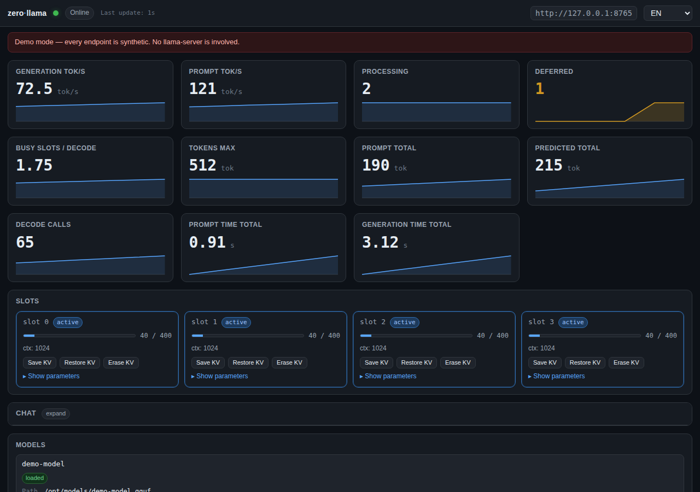

# zerollama-dashboard

为 [llama.cpp](https://github.com/ggml-org/llama.cpp) 服务器提供的、
零依赖、单 HTML 文件的监控仪表盘。

> Languages: [English](README.md) · [한국어](README.ko.md) · [日本語](README.ja.md) · **简体中文** · [Español](README.es.md)

> 灵感来自 [abhiFSD/llama.cpp-Monitor-Dashboard](https://github.com/abhiFSD/llama.cpp-Monitor-Dashboard) (MIT)。
> 无 npm,无 CDN,无 localStorage。仅一个 HTML 文件。

## 在线演示

打开 `monitor.html?demo=1` 即可在内置 mock 服务器上运行仪表盘。所有接口
(`/metrics`、`/slots`、`/props`、`/v1/models`、流式 `/v1/chat/completions`)
均由随时间变化的合成数据应答,卡片会动态更新,槽位在 active/idle 之间切换,
聊天会真实地以 Markdown 流式返回。使用 `?demo=router` 查看多模型路由视图。

因此可以作为静态站点部署,无需任何后端(GitHub Pages 见下方
[部署演示](#部署演示))。

## 截图




## 显示什么

- 实时 `/metrics` (Prometheus): 生成 / 提示 tok/s,处理中 / 排队请求,
  每次解码繁忙槽位数,提示与生成累计计数
- `/slots`: 每个槽位的状态与全部采样参数
  (temperature, top_k, top_p, min_p, repeat_penalty, mirostat, DRY 等)
- `/props` + `/v1/models`: 模型元数据 (vocab, context, embedding 维度,
  参数量, chat template, 模态, 构建信息)
- `/lora-adapters`: 已加载的 LoRA 适配器及缩放
- `/models` (路由模式): 缓存中的全部模型及状态 (loaded /
  loading / unloaded / sleeping / failed) + **每个模型实际启动所用的
  CLI 参数**
- 可选 `server.log` tail (HTTP Range,自动检测; 不可用时自动隐藏)
- **内联引导**: 每个卡片右上角的 ⓘ 工具提示解释相关参数,当状态超出
  阈值时给出建议
- **内置聊天面板**: 流式 `POST /v1/chat/completions`、系统提示词、
  参数滑块、停止按钮,以及用于槽位压力测试的并发分发模式(详见下方)

## 快速开始

### 方式 A — 与 llama-server 同源

```bash
mkdir -p ./public
cp monitor.html ./public/
llama-server -m model.gguf --metrics --port 8080 --path ./public
# 打开 http://localhost:8080/monitor.html
```

### 方式 B — 指向远程服务器

将 `monitor.html` 通过任意静态服务器 (如 `python3 -m http.server`) 提供,
传入 `?server=`:

```
http://localhost:8000/monitor.html?server=http://10.0.0.5:8080
```

远程的 `llama-server` 必须允许 CORS (默认宽松)。

### 路由 (多模型) 模式

启动 llama-server 时**不带** `-m`:

```bash
llama-server --models-dir ./models --metrics --port 8080
```

仪表盘通过探测 `GET /models` 自动检测路由模式。模型选择器会出现在头部。

## URL 参数

| Param | 默认 | 用途 |
|---|---|---|
| `server` | same origin | llama-server base URL |
| `model` | (无) | 路由模式: 默认选中的模型 |
| `poll` | `1000` | 轮询间隔 (ms) |
| `log` | auto | 日志文件路径; 未指定则自动检测,不可达时隐藏面板 |
| `lang` | auto | `en` / `ko` / `ja` / `zh-CN` / `es` (来自浏览器) |
| `prompt` | (无) | 预填聊天输入框(不会自动发送) |
| `demo` | (无) | `1` 启用单模式 mock,`router` 启用路由模式 mock |

设置全部存于 URL — 不使用 localStorage。分享链接 = 同一视图。

## 聊天面板

槽位网格与模型卡片之间有一个可折叠的聊天面板。它与你正在监控的同一个
llama-server 通信,因此可以发送提示并实时观察指标的反应。

- **流式输出**: 来自 `/v1/chat/completions` 的 SSE,token 边到边显示。
  停止按钮可中止进行中的流。
- **Markdown 渲染**: 标题、段落、**加粗**、*斜体*、行内 `code`、代码块、
  有序 / 无序列表、表格 (GFM)、引用、水平线,以及 `[text](https://…)`
  链接。无外部库 — 渲染器使用 `textContent` 直接构建 DOM 节点,
  服务端响应无法注入 HTML 或脚本。
- **系统提示词**: 可选。作为 `role: "system"` 在历史前发送。
- **滑块**: `temperature`、`top_p`、`max_tokens`,以及将同一提示同时
  发送给 N 个槽位的并发分发(1–8) — 用于快速饱和测试。
- **不持久化**: 项目规则不允许 localStorage,刷新页面会清空对话。
  使用 `?prompt=…` 从 URL 预置初始消息。

## 可选: 日志 tail

日志面板通过 `Range: bytes=-65536` 读取静态文件的最后 ~64 KB。需同时满足
**三个条件**:

1. llama-server 的 stdout/stderr 重定向到文件:
   ```bash
   llama-server ... --path ./public > ./public/server.log 2>&1
   ```
   (systemd / docker 默认仅写 stdout — 不会生成文件。)
2. 该文件由与 `monitor.html` 相同的 origin 提供。
3. HTTP 服务器支持 `Range` (cpp-httplib 与 nginx 均支持)。

任一条件不满足,面板将静默隐藏。可用 `?log=path/to/file` 覆盖路径。
用 `?log=` 显式禁用。

## llama-server 要求

- 较新的版本 / 二进制,需暴露 `/metrics`, `/slots`, `/props`,
  `/v1/models`, `/lora-adapters` (均为标准)
- 启用 `/metrics` 需加 `--metrics`
- `--slots` 默认开启;请勿传 `--no-slots`
- 路由模式: 启动时不带 `-m`,使用 `--models-dir` 或 `--models-preset`

## 引导规则 (摘录)

| 信号 | 阈值 | 建议 |
|---|---|---|
| 每次解码繁忙槽位 | 持续 ≥ total_slots 的 90% | 提高 `--parallel` 或降低客户端并发 |
| 排队请求 | > 0 持续 | 提高 `--parallel` 或降低客户端并发 |
| 生成 tok/s 低 + 槽位空闲 | — | 提高 `--n-gpu-layers` |
| `is_sleeping` true | — | 下次请求会重新加载模型 — 调整 `--sleep-idle-seconds` |
| 槽位 `temperature` 0 | — | 贪婪解码 (确定性) |
| 槽位 `temperature` > 1.5 | — | 质量可能下降; 通常 ≤1.0 |
| 槽位 `repeat_penalty` > 1.3 | — | 可能破坏格式; 通常 1.05–1.15 |
| 槽位 `mirostat` ≠ 0 | — | top_p / top_k 被忽略 |
| 路由模型 `failed` | — | 检查 `exit_code`; 检查 args / VRAM |

完整规则集会在触发时渲染到仪表盘的「Active suggestions」面板。

## 部署演示

演示模式(`?demo=1`)无需后端,任何静态托管均可。仓库自带
[`.github/workflows/pages.yml`](.github/workflows/pages.yml),每次 push 到
`main` 时自动发布到 GitHub Pages:

1. 仓库 Settings → **Pages** → **Build and deployment** → Source 选择
   "GitHub Actions"
2. push 到 `main`,工作流构建并部署
3. 访问 `https://<user>.github.io/<repo>/?demo=1`(横幅会确认这是合成数据)

GitHub Pages 免费、HTTPS 自动、无 idle sleep — 可以一直挂着。全部静态,
没有后端需要维护,外部也无从破坏。

## 许可证

[MIT](LICENSE)。灵感来自 [abhiFSD/llama.cpp-Monitor-Dashboard](https://github.com/abhiFSD/llama.cpp-Monitor-Dashboard)。
